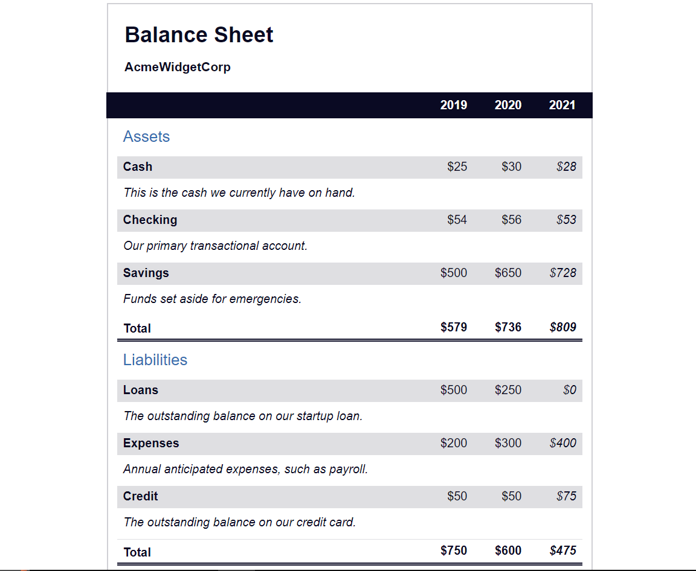

# Balance Sheet
This is a simple HTML and CSS document that shows a balance sheet using three tables. The document contains information on assets, liabilities, and net worth for AcmeWidgetCorp for the years 2019, 2020, and 2021.

## Preview

## Getting Started
To get started with this project, simply clone or download the repository and open the index.html file in your web browser. The styles.css file contains the CSS rules used to style the Balance sheet.

## Prerequisites
To run this project, you will need a web browser such as Google Chrome, Firefox, or Safari.

## Built With
- HTML
- CSS

## Author
This project was created by Kalutu Daniel.

## Credits
This project is based on a challenge from the freeCodeCamp CSS course.
