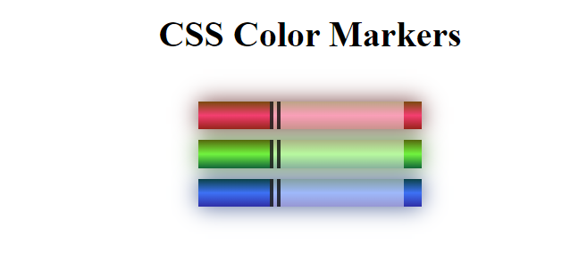

# Colored Markers Web Page
This is a sample web page that displays three colored markers using HTML and CSS. 
The purpose of this web page is to demonstrate the use of HTML and CSS for styling web pages.

## Preview

## Technologies Used
- HTML5
- CSS3

## Files
This project consists of two files:
- index.html: This is the HTML file that defines the structure and content of the web page.
- styles.css: This is the CSS file that defines the visual styling of the web page.

## Installation
To view the web page locally, simply clone this repository and open index.html in your preferred web browser.

## Usage
This web page can be used as a starting point for building more complex web pages using HTML and CSS.

## Credits
This project is based on a challenge from the freeCodeCamp CSS course.
