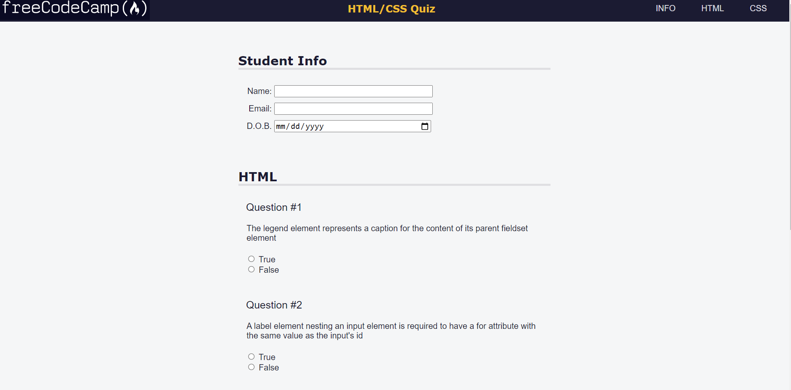

# Accessibility Quiz Form
This is a simple quiz form built with HTML and CSS. It's designed to test a student's knowledge of HTML and CSS, and it consists of three sections: Student Info, HTML Questions, and CSS Questions. The form is accessible and includes proper semantic HTML tags and attributes.

## Preview

## Getting Started
To get started with this project, simply clone or download the repository and open the index.html file in your web browser. The styles.css file contains the CSS rules used to style the label.

## Prerequisites
To run this project, you will need a web browser such as Google Chrome, Firefox, or Safari.

## Built With
- HTML
- CSS

## Author
This project was created by Kalutu Daniel.

## Credits
This project is based on a challenge from the freeCodeCamp CSS course.
