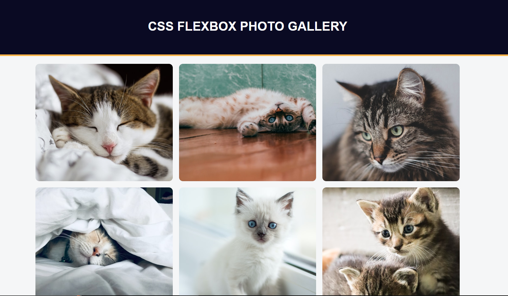

# CSS Flexbox Photo Gallery
This is a simple photo gallery web page built using HTML and CSS with the CSS Flexbox layout.

## Preview

## How to Use
You can view the photo gallery by opening the HTML file in a web browser. The images are displayed using Flexbox to create a responsive and visually appealing layout. The gallery is designed to display nine cat images, but you can replace them with your own images by changing the src attribute of the img tags.

## Built With
- HTML
- CSS
- Flexbox

## Author
This project was created by Kalutu Daniel.

## Credits
This project is based on a challenge from the freeCodeCamp CSS course.

